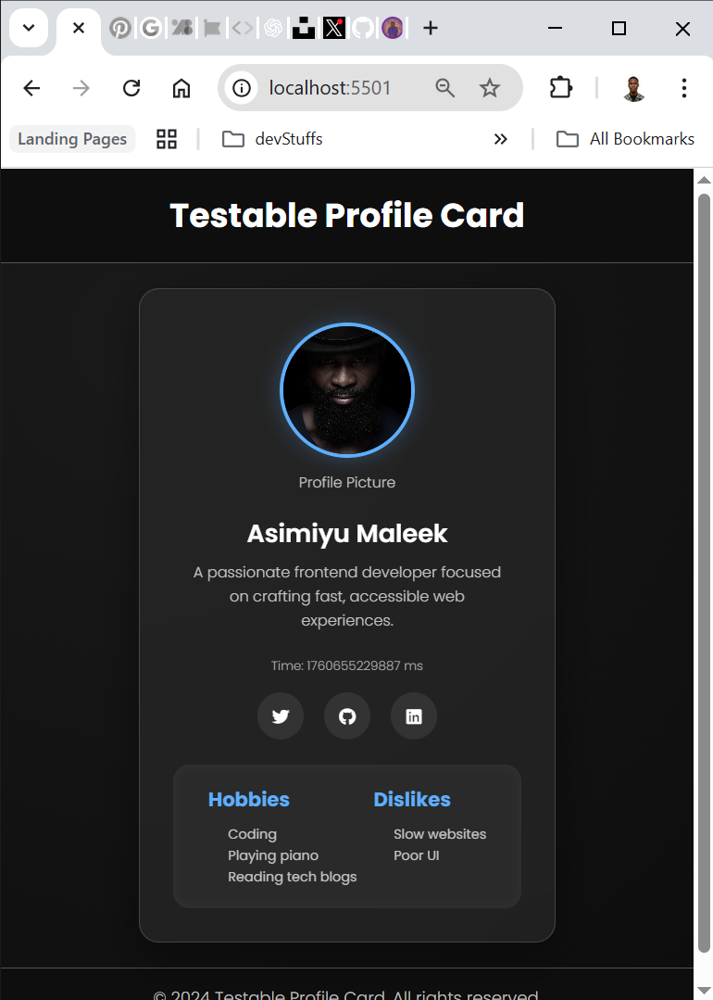
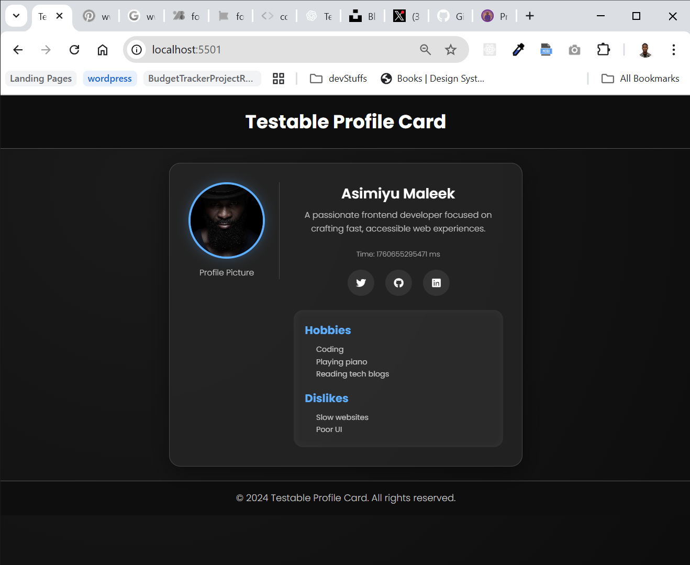

# Testable Profile Card - HNG Stage Zero Task 1

Built a modern, responsive, and accessible **User Profile Card** using **HTML** **CSS**, and **Vanilla Javascript**.

This project was designed to meet the **Stage 0  Testable Card** requirements
------

## Live Demo 
link: [View-Live-on-Netlify]()


## Project Overview

## Stage 0

The **Profile Card** is a small card component displaying 

- The user’s avatar  
- The user's Name  
- A Short biography  
- The Current time (in milliseconds)  
- Social links  
- Hobbies & dislikes 

-----------------------------------------------------------

## 🧩 Required Test IDs
Each visible element has a specific `data-testid` attribute:

| Element | Data Test ID |
|----------|--------------|
| Profile Card Container - `test-profile-card` |
| User Name - `test-user-name` |
| Biography - `test-user-bio` |
| Current Time - `test-user-time` |
| Avatar Image - `test-user-avatar` |
| Social Links Container - `test-user-social-links` |
| Hobby List - `test-user-hobbies` |
| Dislike List - `test-user-dislikes`|

#### According to requirement from the Slack-Community

------------------------------------------------------------


## 🧠 Tech Stack
- **HTML5** (Semantic elements)
- **CSS3** (Flexbox,Responsive design and text Stylings )
- **Vanilla JavaScript** (Dynamic time rendering)

------------------------------------------------------------

## 📸 Screenshot




------------------------------------------------------------

## Stage 1

# 🌐 Stage 1 Frontend Project — Contact & About Pages

Welcome to my Stage 1 HNG program 🚀  
This project builds upon the 0 Task , that was done before, it features two new extra pages *Contact Us page* and an *About Me page*.

---


## 📄 Pages Included

### 📨 Contact Us Page
A responsive and accessible contact form with full validation and success feedback.

*Form Fields (with `data-testid`s):*
- Full Name — test-contact-name
- Email — test-contact-email
- Subject — test-contact-subject
- Message — test-contact-message
- Submit Button — test-contact-submit
- Error Messages — test-contact-error-<field>
- Success Message — test-contact-success


---

### 👩‍💻 About Me Page
A reflective page with proper semantic sections, built to highlight my learning goals and mindset.

*Sections (with `data-testid`s):*
- Bio — test-about-bio
- Goals in this Program — test-about-goals
- Areas of Low Confidence — test-about-confidence
- Note to Future Me — test-about-future-note
- Extra Thoughts — test-about-extra

---

## 🧠 Tech Stack

- *HTML5* — Semantic and accessible structure  
- *CSS3* — Modern, responsive layout (Airbnb-inspired design)  
- *JavaScript (Vanilla)* — Form validation and interactivity  

---


## How to Run Locally
1. Clone the repository 
    using the command
```bash
   git clone 
```
2. Navigate to the folder
    ```bash 
    cd TESTABLE_CARD
    ```

3. Open index.html in your browser
    🥳 And that's all.


