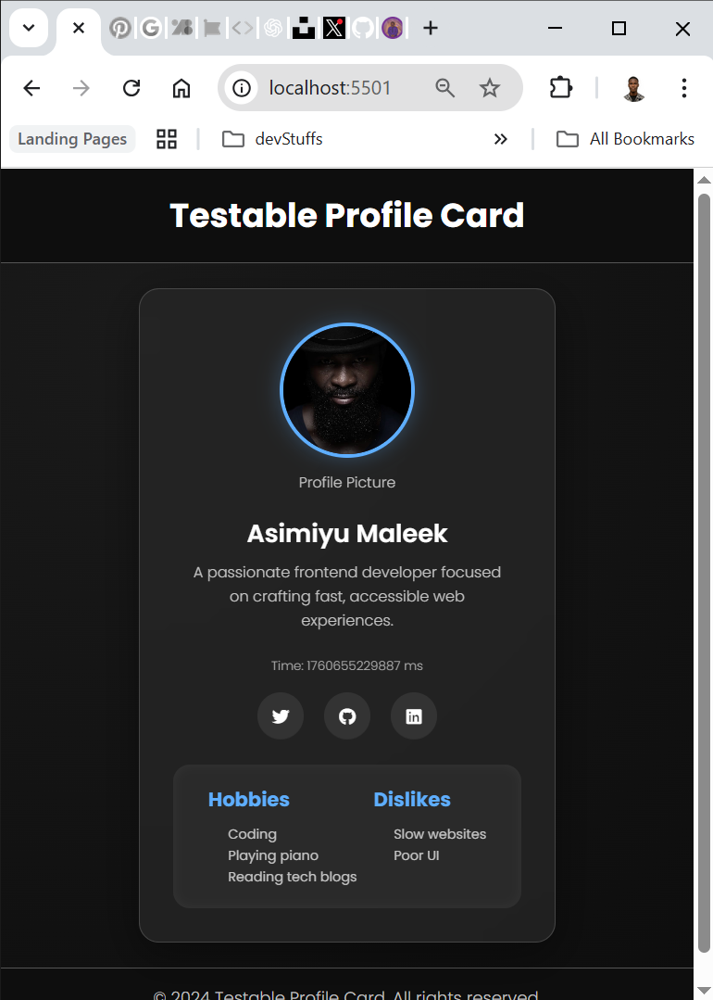
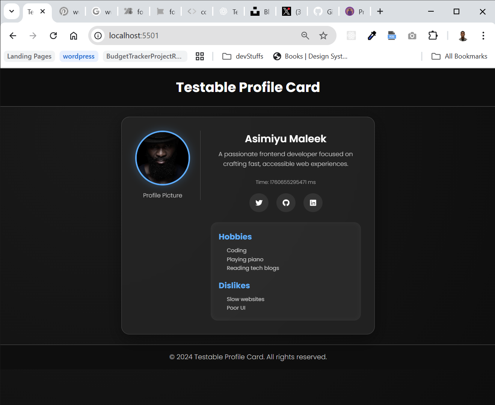

# Testable Profile Card - HNG Stage Zero Task 1

Built a modern, responsive, and accessible **User Profile Card** using **HTML** **CSS**, and **Vanilla Javascript**.

This project was designed to meet the **Stage 0  Testable Card** requirements
------

## Live Demo 
link: [View-Live-on-Netlify]()


## Project Overview

The **Profile Card** is a small card component displaying 

- The user’s avatar  
- The user's Name  
- A Short biography  
- The Current time (in milliseconds)  
- Social links  
- Hobbies & dislikes 

-----------------------------------------------------------

## 🧩 Required Test IDs
Each visible element has a specific `data-testid` attribute:

| Element | Data Test ID |
|----------|--------------|
| Profile Card Container | `test-profile-card` |
| User Name | `test-user-name` |
| Biography | `test-user-bio` |
| Current Time | `test-user-time` |
| Avatar Image | `test-user-avatar` |
| Social Links Container | `test-user-social-links` |
| Hobby List | `test-user-hobbies` |
| Dislike List | `test-user-dislikes`|

#### According to requirement from the Slack-Community

------------------------------------------------------------


## 🧠 Tech Stack
- **HTML5** (Semantic elements)
- **CSS3** (Flexbox,Responsive design and text Stylings )
- **Vanilla JavaScript** (Dynamic time rendering)

------------------------------------------------------------

## 📸 Screenshot



------------------------------------------------------------

## How to Run Locally
1. Clone the repository 
    using the command
```bash
   git clone https://github.com/Ayo-Ma/HNG-Stage-0-Task-Testable-Profile-Card.git
```
2. Navigate to the folder
    ```bash 
    cd TESTABLE_CARD
    ```

3. Open index.html in your browser
    🥳 And that's all.
